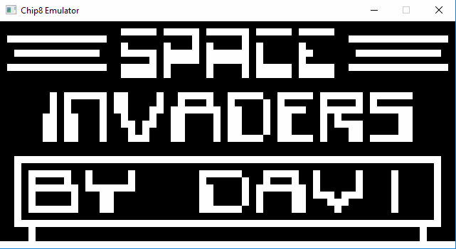

# chip8
Chip8 emulator written in C++ with SDL2 graphics library.

I made this project because I am interested in hardware emulation and
I wanted to see how hard is it to make na emulator (even easy one like this).

